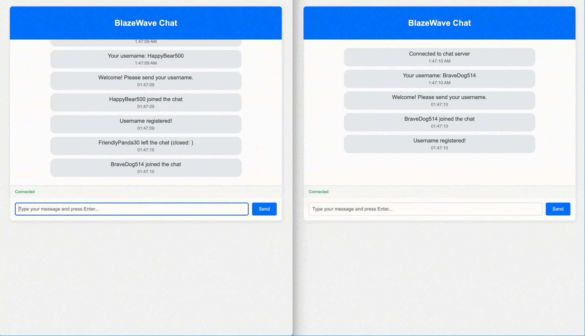

# 🔥 BlazeWave Chat Demo

A real-time group chat demo where users can join, pick a username, and exchange messages instantly. Experience user presence, system notifications, and robust event-driven WebSocket handling with BlazeWave.

## Demo Preview



*Above: Animated demo of the mascot being moved and multiple users interacting in real time.*

## What’s Demonstrated

- **Real-time Messaging:** All users see messages instantly as they are sent.
- **User Presence:** The sidebar displays all currently connected users and their usernames, updated in real time.
- **Username Registration:** Each user is prompted to register a username before chatting.
- **System Notifications:** Join/leave events and errors are clearly shown to all users.
- **Robust Connection Handling:** Supports reconnection and clean disconnection.
- **Minimal Boilerplate:** Both backend and frontend are concise and easy to extend.

## How It Works

- When a user connects, they are prompted to enter a username.
- The server manages all WebSocket connections and tracks usernames.
- Messages and notifications are broadcast to all connected users.
- The user list updates in real time as users join or leave.

## Use Cases

- Learning WebSocket basics and event-driven programming.
- Prototyping real-time chat, notifications, or collaborative features.
- Demonstrating BlazeWave’s event-driven server model and user presence features.

## Getting Started

1. **Start the server:**
   ```sh
   cd examples
   go run chat/main.go
   ```
2. **Open your browser:**  
   Visit [http://localhost:8888](http://localhost:8888)
3. **Try it out:**  
   Open multiple tabs or browsers, register different usernames, and experience real-time group chat and user presence.

## Project Structure

```
chat/
├── main.go        # BlazeWave chat server
├── static/
│   └── index.html # Simple chat frontend
│   └── chat_example.gif   # (Optional) Demo animation of the chat experience
└── README.md      # This documentation
```

---

Experience how BlazeWave makes real-time chat and user presence simple and robust! 