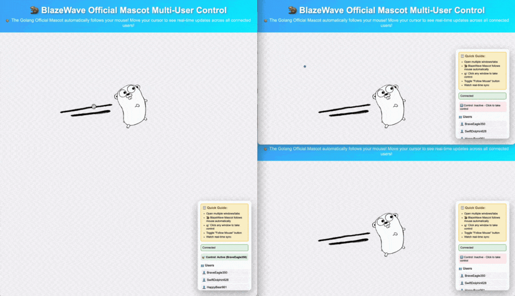

# 🔥 BlazeWave Shared Mascot Demo

A collaborative real-time demo where users can move the Golang mascot, see all online users and usernames, and experience instant synchronization across all connected clients.

## Demo Preview



*Above: Animated demo of the mascot being moved and multiple users interacting in real time.*

## What’s Demonstrated

- **Real-time Collaboration:** Multiple users can move the mascot, and everyone sees updates live.
- **Online User List:** The sidebar displays all currently connected users and their randomly assigned usernames, updated in real time.
- **User Registration:** Each client is automatically assigned a fun username on connection.
- **Shared State Management:** The server keeps track of the mascot’s position and synchronizes it for all users.
- **Event-Driven Architecture:** Clean separation of connection, message, and disconnection handling.
- **Robust Broadcasting:** Updates and user lists are efficiently sent to all clients.

## How It Works

- When a user connects, they receive the current mascot position and the full online user list.
- The sidebar always shows the latest online users and their usernames.
- Users can move the mascot by dragging or by mouse-follow mode; their actions are broadcast to others.
- The server manages all connections, usernames, and ensures state consistency.
- Disconnections and user presence changes are handled gracefully and reflected in the user list.

## Use Cases

- Demonstrating real-time state synchronization and user presence.
- Prototyping collaborative tools, dashboards, or interactive demos.
- Exploring BlazeWave’s event-driven WebSocket API and multi-user features.

## Getting Started

1. **Start the server:**
   ```sh
   cd examples
   go run shared-mascot/main.go  
   ```
2. **Open your browser:**  
   Visit [http://localhost:8888](http://localhost:8888)
3. **Try it out:**  
   Open multiple tabs or browsers. Move the mascot and watch the online user list update in real time as users join or leave.

## Project Structure

```
shared-mascot/
├── main.go        # BlazeWave server implementation
├── static/
│   ├── index.html   # Frontend interface
│   └── mascot.gif   # Mascot image and demo animation
└── README.md     # This documentation
```

---

Experience how BlazeWave makes real-time collaboration and user presence simple and robust! 